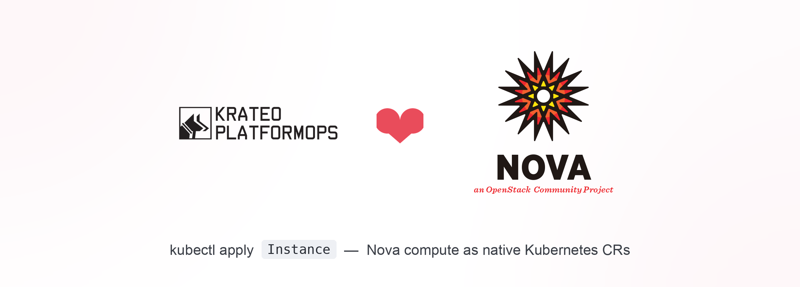

<p align="center">
  
</p>

# openstack-nova-operator-kog

## What is this

A Krateo Operator Generator (KOG) blueprint that turns OpenStack **Nova** compute
resources into native Kubernetes custom resources — validated against
[OVH Public Cloud](https://www.ovhcloud.com/en/public-cloud/) as the managed OpenStack
target.

`kubectl apply` an `Instance` CR → KOG's
[`oasgen-provider`](https://github.com/krateo-platformops/oasgen-provider) and
[`rest-dynamic-controller`](https://github.com/krateo-platformops/rest-dynamic-controller)
reconcile it into a real VM. The chart ships **no controller code of its own**: it
bundles a curated subset of the Nova OpenAPI (one file per resource under
`chart/assets/`) and, for each resource you toggle, emits a `RestDefinition` that KOG
turns into a CRD plus controller. The generated kinds are `Instance` (Servers),
`ComputeFlavor`, `ComputeKeypair`, `ComputeServerGroup`, `ComputeAggregate`, and
`ComputeQuota` (off by default).

Because KOG only speaks the OpenAPI `http/basic` and `http/bearer` security schemes and
Nova authenticates with `X-Auth-Token`, the chart also deploys `nova-auth-bridge`: a
tiny stateless nginx proxy that rewrites `Authorization: Bearer <token>` into
`X-Auth-Token` before forwarding to Nova. It does no Keystone token exchange — see
[docs/architecture.md](docs/architecture.md).

## Install

KOG's `oasgen-provider` must already be in the cluster:

```bash
helm repo add krateo https://charts.krateo.io && helm repo update
helm upgrade --install oasgen-provider krateo/oasgen-provider \
  -n krateo-system --create-namespace
```

Then install this chart, supplying the upstream Nova endpoint (required — the chart
hard-fails on an empty value):

```bash
# Discover the Nova URL + a Keystone token (OVH example)
export OS_AUTH_URL=https://auth.cloud.ovh.net/v3
export OS_USERNAME=... OS_PASSWORD=... OS_PROJECT_ID=... OS_REGION_NAME=GRA11
./scripts/get-token.sh --upstream
# NOVA_URL=https://compute.gra11.cloud.ovh.net/v2.1/<projectId>

helm install nova ./chart -n krateo-system \
  --set authBridge.upstreamUrl="$NOVA_URL"
```

Or install it as a Krateo Composition — apply the `CompositionDefinition`
(`compositiondefinition.yaml`) and drive it through an `OpenstackNovaOperatorKog` CR
(see [Examples](#examples)).

## Configure

Everything is `chart/values.yaml`, fully typed by `chart/values.schema.json`. The two
runtime inputs you always supply are `authBridge.upstreamUrl` (the region-specific Nova
endpoint) and a fresh Keystone token stored in the `nova-token` Secret. Toggle which
Nova resources are exposed with `restdefinitions.<name>.enabled` (`server` and
`flavor` on by default, `quota` off). The whole surface — RestDefinition toggles, the
auth bridge (image, service, resources, scheduling), and overrides — is documented in
[docs/configuration.md](docs/configuration.md).

You are responsible for keeping the Keystone token fresh (OVH default lifetime ~1h);
`./scripts/get-token.sh --secret | kubectl apply -f -` is the supported refresh path.

## Examples

- [examples/nova-composition](examples/nova-composition/README.md) — install the
  blueprint as a Krateo Composition (an `OpenstackNovaOperatorKog` CR).
- `chart/samples/` — worked CRs: `nova-auth.yaml` (the bearer `InstanceConfiguration`),
  `test-server.yaml` (a sample `Instance`), `extra-resources.yaml`
  (`ComputeFlavor` / `ComputeKeypair` / `ComputeServerGroup` / `ComputeAggregate`).

```bash
./scripts/get-token.sh --secret | kubectl apply -f -
kubectl apply -f chart/samples/nova-auth.yaml
# edit chart/samples/test-server.yaml: flavorRef / imageRef / network UUID
kubectl apply -f chart/samples/test-server.yaml
kubectl -n krateo-system get instances.nova.openstack.krateo.io -w
```

## Docs

Full documentation lives in [docs/](docs/):

- [docs/index.md](docs/index.md) — the map of the whole bundle.
- [docs/overview.md](docs/overview.md) — what the blueprint builds and the request flow.
- [docs/usage.md](docs/usage.md) — install, token, create Nova CRs, refresh the token.
- [docs/configuration.md](docs/configuration.md) — the whole values surface.
- [docs/api.md](docs/api.md) — the `CompositionDefinition` and the generated CRDs.
- [docs/examples.md](docs/examples.md) — the runnable examples and sample CRs.
- [docs/release.md](docs/release.md) — how a tag publishes the chart.
- [docs/architecture.md](docs/architecture.md) — diagram and the auth-bridge rationale.
- [docs/quickstart.md](docs/quickstart.md) — the short path to a VM in Horizon.
- [docs/e2e.md](docs/e2e.md) — the full OVH Public Cloud walkthrough on `kind`.
- [docs/e2e-krateo-openstack.md](docs/e2e-krateo-openstack.md) — the same against a
  self-hosted [Krateo-blueprint](https://github.com/krateo-blueprints/krateo-openstack-blueprint)
  OpenStack, with screenshots.

## Develop & release

A single plain-SemVer tag (`X.Y.Z`, no `v` prefix) publishes the chart. Bump
`chart/Chart.yaml` `version`/`appVersion`, merge, then:

```bash
git tag X.Y.Z && git push origin X.Y.Z
```

`release-chart.yaml` lints, verifies the tag matches `Chart.yaml`, packages `chart/`
and pushes it to `oci://ghcr.io/<owner>/charts/openstack-nova-operator-kog:X.Y.Z` — the
artifact the `CompositionDefinition`'s `spec.chart.url` points at. After publishing,
bump `compositiondefinition.yaml`'s `spec.chart.version`. On every PR, `ci.yaml`
(`helm lint` + `helm template` + `kubeconform` + `shellcheck`), `security.yml`, and the
shared `lint-docs` (`lint.yaml`) run. Full runbook in
[docs/release.md](docs/release.md).

## License

Apache-2.0 — see [LICENSE](LICENSE).
