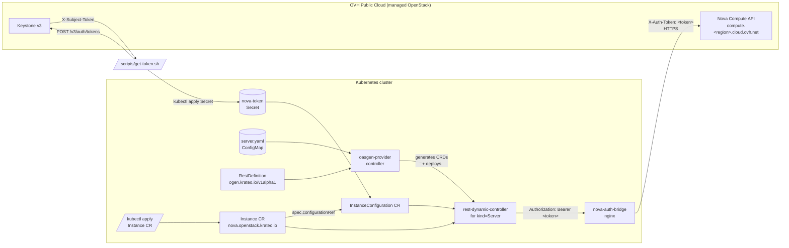

# Architecture



## Component summary

| Component | Source | Role |
|---|---|---|
| `oasgen-provider` | Krateo upstream Helm chart | Reads RestDefinitions and the OAS, generates the `Instance` + `InstanceConfiguration` CRDs and deploys a dedicated `rest-dynamic-controller` to reconcile them. |
| `RestDefinition` (this chart) | `chart/templates/rd-server.yaml` | Declarative pointer to the Nova OAS subset + the verbs we want exposed (`create`, `get`, `delete`). The CRD Kind is `Instance` (configurable; must not be `Server` — see below). |
| Nova OAS subset (this chart) | `chart/assets/server.yaml` | OpenAPI 3.0 with `http/bearer` security and the wrapped `{ "server": {...} }` envelope Nova expects. |
| `nova-auth-bridge` (this chart) | `chart/templates/auth-bridge-*.yaml` | Stateless nginx reverse proxy. Rewrites `Authorization: Bearer <t>` (what the Rest Dynamic Controller emits) to `X-Auth-Token: <t>` (what Nova expects). No Keystone exchange. |
| `InstanceConfiguration` CR (auto-generated) | `chart/samples/nova-auth.yaml` | KOG-generated configuration CR; `spec.authentication.bearer.tokenRef` references the Secret holding the pre-fetched Keystone token. |
| `Instance` CR (auto-generated) | `chart/samples/test-server.yaml` | Concrete instance request (`spec.server.*` plus `spec.configurationRef`); reconciled into a Nova VM. |
| `scripts/get-token.sh` | this repo | Out-of-band Keystone token fetch helper; emits a `kubectl apply`-ready Secret. |

## Why a header-rewrite proxy?

KOG's `oasgen-provider` only accepts `http/basic` and `http/bearer`
security schemes (see
`oasgen-provider/internal/tools/oas2jsonschema/configuration_builder.go`
and the `apiKey` enum value flagged "Currently not supported" in
`types.go`). The `rest-dynamic-controller` then unconditionally sends
`Authorization: Bearer <token>` when a bearer scheme is in play
(`rest-dynamic-controller/internal/tools/definitiongetter/getter.go`).

Nova accepts only `X-Auth-Token`. Three ways to bridge that gap:

1. **Plugin / wrapper web service that does Keystone exchange + bearer.**
   Cleanest for users (they only manage username/password); much more
   code to write and operate.
2. **Sidecar token refresher + apiKey scheme.** Blocked because KOG
   doesn't support apiKey today.
3. **Stateless header-rewrite proxy + pre-fetched token.** Demo-friendly
   (you must refresh the token Secret hourly), tiny operational surface
   (an nginx ConfigMap), no new code paths.

This chart implements (3). When upstream KOG grows apiKey support, the
proxy can be removed in favor of an `apiKey/header/X-Auth-Token` scheme
in the OAS.

## Why is the Kind `Instance` and not `Server`?

Nova's create payload wraps everything in a `{ "server": {...} }`
envelope, so the OAS request body has a top-level property named
`server` and the generated CR spec therefore has `spec.server`. If the
CRD Kind is also `Server`, `crdgen` (the schema-to-CRD generator inside
`oasgen-provider`) conflates the `server` property with the managed
`Server` type and scaffolds it as a full Kubernetes object, emitting an
empty-`type` `spec: {}` node. The API server then rejects the CRD:

```
spec.validation.openAPIV3Schema.properties[spec].properties[server].properties[spec].type:
  Required value: must not be empty for specified object fields
```

The `server` property name is mandated by Nova, so the fix is to name
the Kind something else. The chart defaults to `Instance`
(`restdefinitions.server.resourceKind`), which yields
`instances.nova.openstack.krateo.io` and the companion
`instanceconfigurations.nova.openstack.krateo.io`.

## Why the `server.*` identifiers and `requestFieldMapping`

The same `{ "server": {...} }` envelope wraps Nova's *responses*. The
`rest-dynamic-controller` extracts the configured `identifiers` from the
response body by JSONPath and would, by default, look for `id`/`name` at
the root — where Nova has nothing. So the RestDefinition uses
`identifiers: [server.id, server.name]` (and `additionalStatusFields:
server.*`), which land in the CR as `status.server.id`, etc.

Path parameters are only auto-filled from *top-level* CR fields, so the
`{id}` in `GET`/`DELETE /servers/{id}` can't be sourced from the nested
`status.server.id` automatically. The `get` and `delete` verbs therefore
declare an explicit `requestFieldMapping` (`inPath: id` ←
`inCustomResource: status.server.id`). Without these two pieces the
create succeeds but the server id is never captured, so observe/delete
hit `/servers/{id}` literally (404) and the CR can neither report status
nor be cleaned up.
