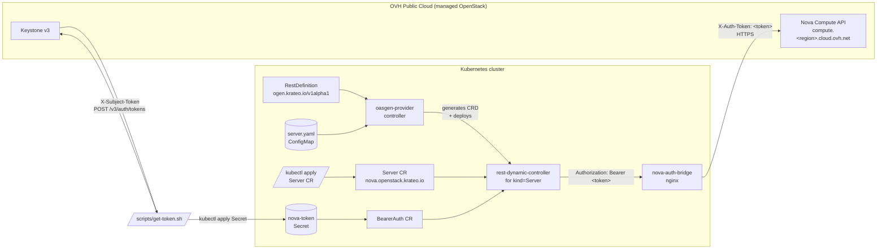

# Architecture

## Component summary

| Component | Source | Role |
|---|---|---|
| `oasgen-provider` | Krateo upstream Helm chart | Reads RestDefinitions and the OAS, generates the `Server` CRD and deploys a dedicated `rest-dynamic-controller` to reconcile it. |
| `RestDefinition` (this chart) | `chart/templates/rd-server.yaml` | Declarative pointer to the Nova OAS subset + the verbs we want exposed (`create`, `get`, `delete`). |
| Nova OAS subset (this chart) | `chart/assets/server.yaml` | OpenAPI 3.0 with `http/bearer` security and the wrapped `{ "server": {...} }` envelope Nova expects. |
| `nova-auth-bridge` (this chart) | `chart/templates/auth-bridge-*.yaml` | Stateless nginx reverse proxy. Rewrites `Authorization: Bearer <t>` (what the Rest Dynamic Controller emits) to `X-Auth-Token: <t>` (what Nova expects). No Keystone exchange. |
| `BearerAuth` CR (auto-generated) | `chart/samples/nova-auth.yaml` | KOG-generated authentication CR; references the Secret holding the pre-fetched Keystone token. |
| `Server` CR (auto-generated) | `chart/samples/test-server.yaml` | Concrete instance request; reconciled into a Nova VM. |
| `scripts/get-token.sh` | this repo | Out-of-band Keystone token fetch helper; emits a `kubectl apply`-ready Secret. |

## Why a header-rewrite proxy?

KOG's `oasgen-provider` only accepts `http/basic` and `http/bearer`
security schemes (see
`oasgen-provider/internal/tools/oas2jsonschema/configuration_builder.go`
and the `apiKey` enum value flagged "Currently not supported" in
`types.go`). The `rest-dynamic-controller` then unconditionally sends
`Authorization: Bearer <token>` when a bearer scheme is in play
(`rest-dynamic-controller/internal/tools/definitiongetter/getter.go`).

Nova accepts only `X-Auth-Token`. Three ways to bridge that gap:

1. **Plugin / wrapper web service that does Keystone exchange + bearer.**
   Cleanest for users (they only manage username/password); much more
   code to write and operate.
2. **Sidecar token refresher + apiKey scheme.** Blocked because KOG
   doesn't support apiKey today.
3. **Stateless header-rewrite proxy + pre-fetched token.** Demo-friendly
   (you must refresh the token Secret hourly), tiny operational surface
   (an nginx ConfigMap), no new code paths.

This chart implements (3). When upstream KOG grows apiKey support, the
proxy can be removed in favor of an `apiKey/header/X-Auth-Token` scheme
in the OAS.
