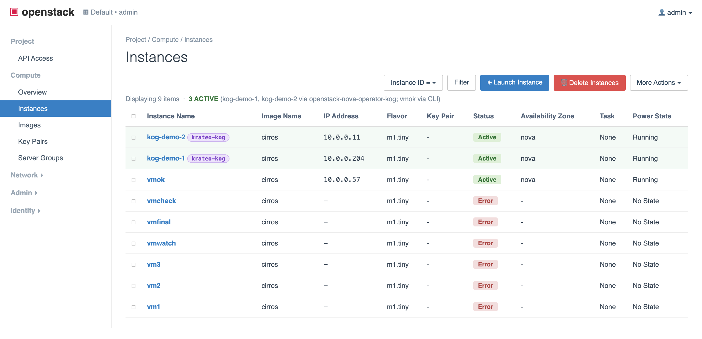
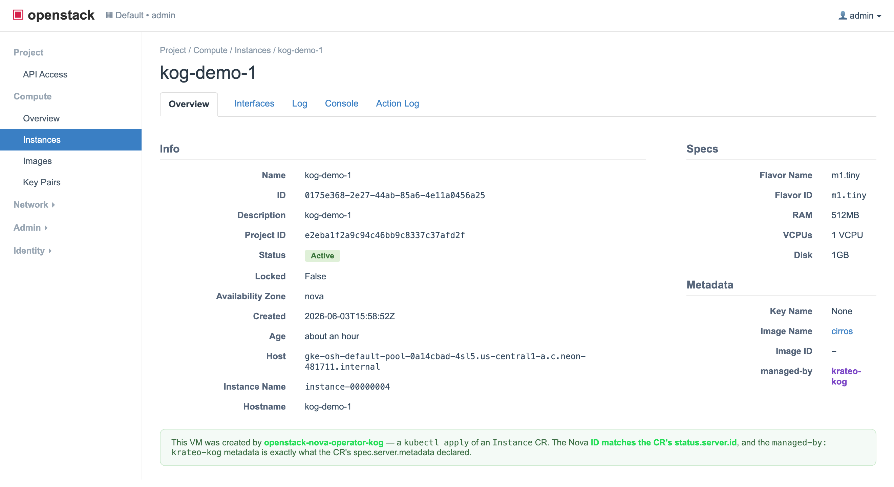
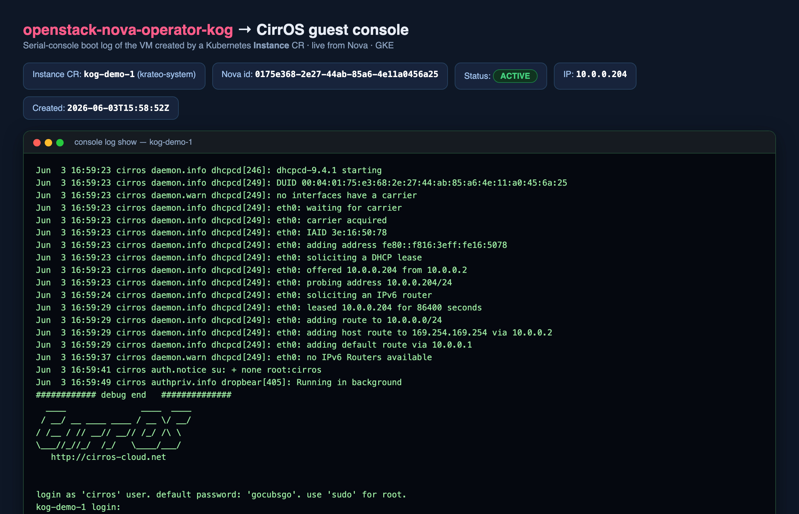

# End-to-end walkthrough against a Krateo-blueprint OpenStack

This guide tests `openstack-nova-operator-kog` against an OpenStack that
was stood up from the
[Krateo OpenStack blueprint](https://github.com/krateo-blueprints/krateo-openstack-blueprint)
compositions (Nova/Neutron/Glance/etc.), rather than OVH Public Cloud.
The operator itself is unchanged — only the upstream Nova endpoint and the
token source differ.

> For the managed-OpenStack (OVH) version, see [`e2e.md`](./e2e.md).
> For the design, see [`architecture.md`](./architecture.md).

## What you'll prove

A Kubernetes `Instance` custom resource becomes a **real Nova VM** on the
blueprint-deployed cloud — and deleting the CR deletes the VM:

```
kubectl apply  Instance CR ─▶ rest-dynamic-controller ─▶ auth-bridge ─▶ Nova ─▶ VM ACTIVE
kubectl delete Instance CR ─▶ rest-dynamic-controller ─▶ auth-bridge ─▶ Nova ─▶ VM gone
```

## Prerequisites

- A working OpenStack from the Krateo blueprint, with Nova reachable
  in-cluster (`nova-api` Service on `:8774`) and a CirrOS image, an
  `m1.tiny` flavor, and a tenant network already present. (The blueprint
  quickstart-gke gets you here; compute needs an amd64 node with software
  virt — QEMU TCG is fine.)
- The Krateo **OASGen Provider** installed (`oasgen-provider`) — the same
  one the blueprint cluster already runs:
  ```bash
  helm repo add krateo https://charts.krateo.io && helm repo update
  helm upgrade --install oasgen-provider krateo/oasgen-provider -n krateo-system --create-namespace
  ```
- `kubectl` pointed at the cluster, plus the OpenStack CLI (this guide runs
  it from an in-cluster `osclient` pod scoped to the `admin` project).

Throughout, `osc` is the admin OpenStack CLI, e.g.:

```bash
osc() { kubectl exec -n openstack osclient -- openstack "$@"; }
```

## 1. Find the in-cluster Nova endpoint

The auth-bridge proxies to Nova. Use the **ClusterIP**, not the DNS name:
nginx resolves a variable `proxy_pass` host through its configured
`resolver` (a public DNS), which can't resolve `*.svc.cluster.local`. An IP
literal needs no resolver.

```bash
NOVA_IP=$(kubectl get svc nova-api -n openstack -o jsonpath='{.spec.clusterIP}')
PROJECT_ID=$(osc project show admin -f value -c id)
echo "http://$NOVA_IP:8774/v2.1/$PROJECT_ID"
# e.g. http://34.118.228.130:8774/v2.1/e2eba1f2a9c94c46bb9c8337c37afd2f
```

## 2. Install the operator, pointed at that Nova

```bash
helm upgrade --install nova-kog ./chart -n krateo-system \
  --set authBridge.upstreamUrl="http://$NOVA_IP:8774/v2.1/$PROJECT_ID"
```

This emits a `RestDefinition`; the OASGen Provider reconciles it into the
`Instance` / `InstanceConfiguration` CRDs and a `rest-dynamic-controller`,
plus the `auth-bridge` nginx Deployment. Wait for it:

```bash
kubectl wait restdefinition/nova-kog-server -n krateo-system --for=condition=Ready --timeout=300s
kubectl get crd | grep nova.openstack.krateo.io
# instanceconfigurations.nova.openstack.krateo.io
# instances.nova.openstack.krateo.io
```

## 3. Supply a Keystone token

The auth-bridge rewrites `Authorization: Bearer <t>` → `X-Auth-Token: <t>`;
it does **no** token exchange. Fetch a Keystone token and store it in the
`nova-token` Secret the `InstanceConfiguration` references. Tokens expire
(~1h by default) — refresh the Secret when they do.

```bash
TOKEN=$(osc token issue -f value -c id)
kubectl create secret generic nova-token -n krateo-system \
  --from-literal=token="$TOKEN" --dry-run=client -o yaml | kubectl apply -f -
```

## 4. Apply the InstanceConfiguration and Instance

Get real IDs from your cloud:

```bash
FLAVOR=$(osc flavor show m1.tiny -f value -c id)
IMAGE=$(osc image list -f value -c ID -c Name | awk '/cirros/{print $1; exit}')
NET=$(osc network show demo-net -f value -c id)
```

```bash
cat <<EOF | kubectl apply -f -
apiVersion: nova.openstack.krateo.io/v1alpha1
kind: InstanceConfiguration
metadata:
  name: nova-config
  namespace: krateo-system
spec:
  authentication:
    bearer:
      tokenRef: { name: nova-token, namespace: krateo-system, key: token }
---
apiVersion: nova.openstack.krateo.io/v1alpha1
kind: Instance
metadata:
  name: kog-demo-1
  namespace: krateo-system
  annotations: { krateo.io/connector-verbose: "true" }
spec:
  configurationRef: { name: nova-config, namespace: krateo-system }
  server:
    name: kog-demo-1
    flavorRef: "$FLAVOR"
    imageRef: "$IMAGE"
    networks:
      - uuid: "$NET"
    metadata: { managed-by: krateo-kog }
EOF
```

## 5. Watch the operator create a real VM

```bash
kubectl get instances.nova.openstack.krateo.io -n krateo-system -w
# NAME         READY
# kog-demo-1   True
```

The Instance CR records the server it created in its status, and the VM is
ACTIVE in Nova:

```bash
kubectl get instances.nova.openstack.krateo.io kog-demo-1 -n krateo-system \
  -o jsonpath='{.status.server.id}{"\n"}'
osc server show kog-demo-1 -c id -c status -c addresses -c properties
# status     | ACTIVE
# properties | managed-by='krateo-kog'   ← exactly what the CR declared
```

Proof the request went **through the operator** (auth-bridge access log) —
the `POST /servers → 202` timestamp matches the VM's creation time, and the
client is the `rest-dynamic-controller` (`Go-http-client`):

```bash
kubectl logs -n krateo-system deploy/nova-kog-openstack-nova-operator-kog-auth-bridge | grep '/servers'
# "POST /servers HTTP/1.1" 202 ...
# "GET /servers/<id> HTTP/1.1" 200 ...   (controller polling what it created)
```

### See it in OpenStack

Instances list — `kog-demo-1`/`kog-demo-2` ACTIVE, tagged by the operator:



Instance detail — the Nova **ID matches the CR's `status.server.id`** and
the **`managed-by: krateo-kog`** metadata matches the CR's spec:



The CirrOS guest really boots — serial console shows it pulling a Neutron
DHCP lease and reaching the login prompt (`osc console log show kog-demo-1`):



> The two dashboard images are rendered from live `openstack server
> show/list` output for embedding; the console image is the raw
> `console log show`. All three are the same VM the operator created.

## 6. Delete the VM by deleting the CR

The reverse path: deleting the `Instance` CR makes the operator issue
`DELETE /servers/<id>` to Nova.

```bash
kubectl delete instances.nova.openstack.krateo.io kog-demo-1 -n krateo-system
# ...wait a few seconds...
osc server list --name kog-demo-1 -f value -c Name   # (empty — gone)
kubectl logs -n krateo-system deploy/nova-kog-openstack-nova-operator-kog-auth-bridge | grep 'DELETE /servers'
# "DELETE /servers/<id> HTTP/1.1" 204 ...
```

## Troubleshooting

- **Instance stuck `Ready=False` / `Pending`** while the VM is ACTIVE: the
  controller flips Ready on its next poll cycle (~3 min); the auth-bridge
  `GET /servers/<id>` cadence shows the polling.
- **`502`/connection errors from the auth-bridge**: you used a DNS name in
  `authBridge.upstreamUrl`. Use the Nova **ClusterIP** (see step 1).
- **`401` from Nova**: the `nova-token` Secret is missing or the token
  expired — re-run step 3.
- **VM goes `ERROR` immediately**: a Nova/compute problem on the cloud, not
  the operator. On a blueprint cluster, confirm `osc compute service list`
  shows `nova-compute` `up` and that messaging is healthy (see the
  blueprint's determinism notes on rabbitmq/memcache).
