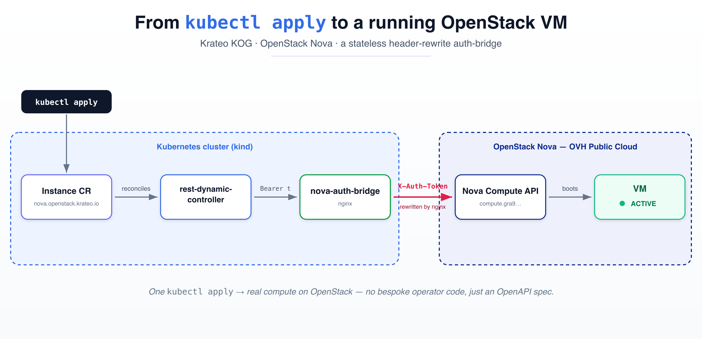

# From `kubectl apply` to a running OpenStack VM — with zero operator code

*How Krateo's Operator Generator (KOG) turns the OpenStack Nova API into a
native Kubernetes CRD — and the five very real bugs we hit booting an
OpenStack VM, validated against OVH Public Cloud as the managed-OpenStack
target.*



---

## The pitch

What if you could manage an OpenStack virtual machine the same way you
manage a `Deployment` — write a YAML manifest, `kubectl apply`, and let a
controller reconcile reality to match? And what if you could do that
**without writing a single line of Go**, just by handing Kubernetes an
OpenAPI description of the API you want to wrap?

That's the promise of [Krateo](https://krateo.io)'s **Operator Generator
(KOG)**. You give its `oasgen-provider` an OpenAPI spec and a small
`RestDefinition`, and it generates a CRD and spins up a generic
`rest-dynamic-controller` that reconciles your custom resource by calling
the underlying REST API.

This article is the story of pointing that machinery at **OpenStack Nova**
— and the five concrete problems that stood between "it renders" and
"there's a VM running." None of them showed up in CI. All of them showed
up the moment we ran it for real.

Nothing here is OVH-specific: the target is the standard OpenStack
Compute (Nova) API, so the same chart works against any Keystone + Nova
endpoint (a private cloud, Devstack, another public provider). **OVH
Public Cloud** is simply the managed OpenStack we validated against — the
only OVH-flavoured details are the example endpoint/region and a couple
of Keystone token-fetch quirks (Bug #4).

---

## The architecture (and the one awkward bit)

The moving parts:

- **`oasgen-provider`** — reads a `RestDefinition` + an OpenAPI spec,
  generates a CRD, and deploys a dedicated `rest-dynamic-controller` for
  it.
- **`rest-dynamic-controller`** — the generic reconciler. For each CR it
  calls the API verbs you declared (create/get/delete).
- **Our chart** — an OpenAPI subset of Nova's *Servers* API, the
  `RestDefinition`, and one extra component explained below.

The awkward bit: **authentication**. KOG only understands OpenAPI
`http/basic` and `http/bearer` security schemes. It emits
`Authorization: Bearer <token>`. But OpenStack Nova authenticates with a
Keystone token in the **`X-Auth-Token`** header. Those don't match.

Rather than fork KOG, we ship a tiny, stateless **nginx "auth-bridge"**
inside the chart that rewrites the header on the way through:

```nginx
map $http_authorization $os_token {
    default              "";
    "~*^Bearer\s+(.+)$"  $1;
}

server {
    location / {
        proxy_pass        https://compute.<region>.cloud.ovh.net/v2.1/<project-id>$request_uri;
        proxy_set_header  X-Auth-Token  $os_token;   # Bearer -> X-Auth-Token
        proxy_ssl_server_name on;
    }
}
```

No Keystone exchange, no state — just a header rewrite. You fetch a token
out-of-band, drop it in a Secret, and refresh it when it expires (~1h on
OVH). The controller thinks it's talking bearer; Nova receives
`X-Auth-Token`.

So the data path is:

```
kubectl apply Instance CR
        │
        ▼
rest-dynamic-controller ──Authorization: Bearer <t>──► nova-auth-bridge (nginx)
                                                              │
                                                  X-Auth-Token: <t>
                                                              ▼
                                         OpenStack Nova Compute API ──► VM
```

---

## Bug #1 — The controller called a Service that didn't exist

The OpenAPI spec's `servers[].url` is the base address the generated
controller hits. Ours was hardcoded:

```yaml
servers:
  - url: http://nova-auth-bridge.krateo-system.svc.cluster.local
```

But the chart deploys the bridge Service under its Helm fullname —
`nova-openstack-nova-operator-kog-auth-bridge`. So the controller would
have dialed a hostname that never resolves. `helm lint` and `kubeconform`
were perfectly happy, because nothing validates in-cluster DNS.

**Fix:** template the URL from a helper that derives the real Service name
and namespace. Lesson: render-only CI can't catch a name that's only
wrong at runtime.

---

## Bug #2 — Naming a CRD `Server` produces an invalid CRD

We named the Kind `Server` — obvious, it's the Nova *Servers* API. The
`RestDefinition` reconciled to:

```
CustomResourceDefinition "servers.nova.openstack.krateo.io" is invalid:
spec...openAPIV3Schema.properties[spec].properties[server].properties[spec].type:
Required value: must not be empty for specified object fields
```

Nova wraps its create body in an envelope — `{ "server": { ... } }` — so
the generated CR spec has a property literally named `server`. KOG's
schema generator (`crdgen`) then **collides** the `server` *property* with
the managed `Server` *type* and scaffolds it as a full Kubernetes object,
emitting an empty-`type` `spec: {}` node that the API server rejects.

We proved it with a control run: rename the Kind to anything else and the
CRD generates cleanly.

**Fix:** the property name `server` is mandated by Nova, so the Kind has
to change. We named it **`Instance`** (and made it configurable), giving
`instances.nova.openstack.krateo.io`.

---

## Bug #3 — The auth model in our samples didn't exist

Our sample manifests authenticated with a `BearerAuth` CR referenced via
`spec.authenticationRefs.bearerAuthRef`. We'd written them against an
*assumed* KOG model. The deployed `oasgen-provider` actually generates a
**different** shape — two CRDs:

```yaml
# InstanceConfiguration: holds the auth
spec:
  authentication:
    bearer:
      tokenRef: { name: nova-token, namespace: krateo-system, key: token }
---
# Instance: references the configuration + the request body
spec:
  configurationRef: { name: nova-config, namespace: krateo-system }
  server:
    name: demo
    flavorRef: <uuid>
    imageRef:  <uuid>
    networks:  [{ uuid: <uuid> }]
```

**Fix:** rewrite samples and docs to the real `InstanceConfiguration` +
`configurationRef` model. Lesson: read the *generated* CRDs, don't trust
your mental model of the framework.

---

## Bug #4 — The OVH `openrc` file silently broke token fetching

To get a Keystone token we wrote a small `get-token.sh`. It worked from
hand-set env vars, but the moment we `source`d OVH's downloaded
`openrc.sh`, every request 401'd. Two surprises hid here:

1. OVH's openrc sets `OS_AUTH_URL=https://auth.cloud.ovh.net/` — **without
   the `/v3`**. The `openstack` CLI appends the version itself; our raw
   `curl` didn't, so it POSTed to `/auth/tokens` (404, then a confusing
   401 elsewhere).
2. The openrc sets `OS_USER_DOMAIN_NAME=ovhcloud-emea` (the SSO/account
   domain) for an account-style nic-handle user. A plain Keystone password
   grant against that domain is rejected. The same user authenticates
   fine in the **`Default`** domain — and the supported path is a
   dedicated project OpenStack user (`user-XXXX`).

**Fix:** normalize the auth URL to always hit `/v3/auth/tokens`, gitignore
`*openrc*.sh` so credentials can't be committed, and (operationally) use
`OS_USER_DOMAIN_NAME=Default`.

---

## It boots! 🎉

With those fixed, we applied an `Instance`. The controller POSTed through
the bridge and Nova answered:

```
POST /servers  ->  HTTP/1.1 202 Accepted
{"server": {"id": "90bff0b3-...", "adminPass": "...", ...}}
```

A `kubectl apply` had created a **real, ACTIVE OpenStack VM** (running on
OVH), complete with a public IP. The entire chain — CR → KOG controller →
header-rewrite bridge → Nova — worked against live infrastructure.

---

## Bug #5 — The VM existed, but Kubernetes couldn't see or delete it

Victory was short-lived. The CR's `status` stayed empty, and the next
reconcile did this:

```
GET /servers/%7Bid%7D   ->   404  "Instance {id} could not be found."
```

`%7Bid%7D` is the URL-encoded literal `{id}` — the path placeholder was
never substituted. Worse, on delete the controller hit the same dead URL,
got a 404, treated it as an error, and **left the finalizer in place** —
the CR was stuck terminating while the VM kept billing.

Reading `rest-dynamic-controller` at the deployed version pinned it down:
the controller extracts the configured `identifiers` (`id`, `name`) from
the response body **at the root** — but Nova nests them inside the same
`server` envelope (`.server.id`). So the created server's id was never
captured, and `{id}` had nothing to fill it.

**Fix** — pure `RestDefinition` config, no controller patch:

```yaml
identifiers:
  - server.id          # dotted JSONPath into the envelope
  - server.name
additionalStatusFields:
  - server.status
  - server.addresses
verbsDescription:
  - action: get
    path: /servers/{id}
    requestFieldMapping:           # path params come from top-level
      - inPath: id                 # CR fields only, so map it explicitly
        inCustomResource: status.server.id
  - action: delete
    path: /servers/{id}
    requestFieldMapping:
      - inPath: id
        inCustomResource: status.server.id
```

After redeploying, the full lifecycle worked:

- **Create** → VM boots, `status.server.id` populated, status shows
  `ACTIVE` + public IP, CR `Ready=True`.
- **Delete** → `kubectl delete` makes the operator issue `DELETE` with the
  real id, OVH removes the VM, the finalizer clears cleanly.

And here's the proof — the reconciled `Instance`, `spec` you declared and
`status` the controller wrote back:

```yaml
apiVersion: nova.openstack.krateo.io/v1alpha1
kind: Instance
metadata:
  name: kog-demo-1
spec:  # what you declare
  configurationRef:
    name: nova-config
  server:
    name: kog-demo-1
    flavorRef: 906e8259-...  # b2-7
    imageRef: e65d6156-...   # Ubuntu 24.04
    networks:
      - uuid: b2c02fdc-...   # Ext-Net
status:  # populated by the controller
  server:
    id: 39f18f87-0502-4e4b-9c0b-...
    status: ACTIVE
    addresses:
      Ext-Net:
        - addr: 217.182.163.210
          version: 4
  conditions:
    - type: Ready
      status: "True"
```

---

## Takeaways

- **"It renders" ≠ "it works."** Helm lint and schema validation passed
  for every one of these bugs. Four of five only surfaced against a live
  API. If you're packaging an operator, your CI needs a real (or
  kind-hosted) reconcile, not just `helm template`.
- **Envelopes are the recurring villain.** Nova's `{ "server": {...} }`
  wrapper caused *both* the CRD-generation collision (Kind vs. property)
  *and* the identifier-extraction failure. When you wrap a request body,
  expect the response to be wrapped too, and configure for it.
- **Read the generated artifacts.** The biggest time sinks came from
  trusting an assumed framework model instead of inspecting the CRDs the
  generator actually produced.
- **Generic operators are a real shortcut.** Once the spec and
  `RestDefinition` are right, you get create/observe/delete reconciliation
  for an external API with *no* bespoke controller code. The leverage is
  enormous — the work is in describing the API precisely, including its
  quirks.

---

## Try it

Everything is open source:
**[github.com/braghettos/openstack-nova-operator-kog](https://github.com/braghettos/openstack-nova-operator-kog)**.

A `kind` cluster, the Krateo `oasgen-provider`, this chart, and any
OpenStack project (we used OVH Public Cloud) are all you need. The repo
includes a full walkthrough (`docs/e2e.md`) — bootstrap, token fetch,
provision, and cleanup — and a short quickstart in the README.

```bash
helm install oasgen-provider krateo/oasgen-provider -n krateo-system --create-namespace
helm install nova ./chart -n krateo-system --set authBridge.upstreamUrl="$NOVA_URL"
./scripts/get-token.sh --secret | kubectl apply -f -
kubectl apply -f chart/samples/nova-auth.yaml      # InstanceConfiguration
kubectl apply -f chart/samples/test-server.yaml    # Instance
kubectl -n krateo-system get instances.nova.openstack.krateo.io -w
```

Then watch a row go `Ready`, and an actual VM appear in your OpenStack
(OVH) console.

*Don't forget to `kubectl delete` it — it bills by the hour.*
