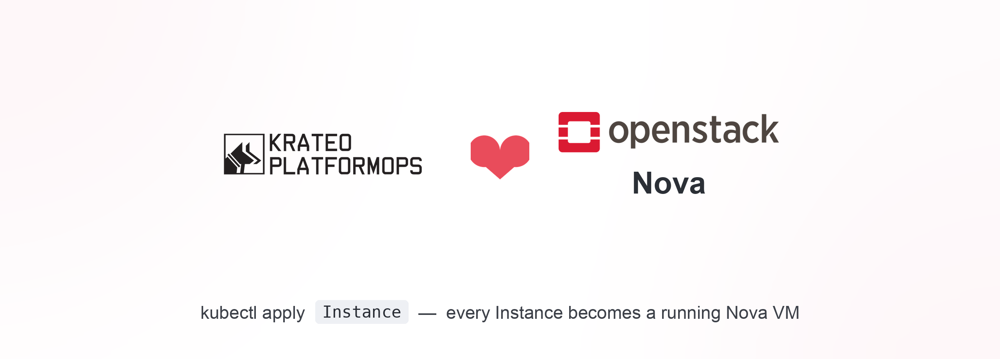
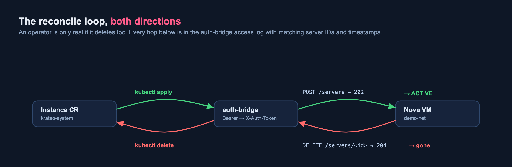

# An OpenStack Compute Kubernetes Operator with Krateo — and zero operator code

*Turning the OpenStack Nova API into a native Kubernetes CRD with Krateo's
Operator Generator (KOG), then driving real VMs on a self-hosted,
blueprint-deployed OpenStack: `kubectl apply` an `Instance` → an ACTIVE
VM; `kubectl delete` it → the VM is gone.*

> 📘 **Part 2 of a two-part series.** [**Part 1 — *OpenStack-as-a-Service with
> Krateo: one Composition, one cloud***](https://medium.com/@diego.braga86/openstack-as-a-service-with-krateo-one-composition-one-cloud-1ff0bbb68809)
> builds the cloud itself from Krateo blueprints. This part puts a Kubernetes
> operator **on** that cloud — and drives real VMs on it.


---

## The pitch

What if you managed an OpenStack VM the way you manage a `Deployment` —
write YAML, `kubectl apply`, and let a controller reconcile reality to
match? And what if you could do that **without writing a single line of
controller code**, just by handing Kubernetes an OpenAPI description of the
API you want to wrap?

That's [Krateo](https://krateo.io)'s **Operator Generator (KOG)**. You give
its `oasgen-provider` an OpenAPI spec and a small `RestDefinition`, and it
generates a CRD and runs a generic **`rest-dynamic-controller`** that
reconciles your custom resource by calling the underlying REST API.

This article points that machinery at **OpenStack Nova** and tests it
against an OpenStack we built ourselves from
[Krateo blueprints](https://github.com/braghettos/krateo-openstack-blueprint)
(the subject of [Part 1](https://medium.com/@diego.braga86/openstack-as-a-service-with-krateo-one-composition-one-cloud-1ff0bbb68809)).
The result is a self-contained loop: **a Kubernetes operator that creates VMs
on a Kubernetes-deployed cloud — neither side hand-written.**

---

## The architecture (and the one awkward bit)


Three pieces ship in the chart:

1. A hand-curated **OpenAPI subset** of Nova's `/servers` endpoints, bundled
   into a ConfigMap.
2. A **`RestDefinition`** that points oasgen-provider at that spec. From it,
   KOG generates the `Instance` and `InstanceConfiguration` CRDs and the
   `rest-dynamic-controller`.
3. A tiny stateless **`auth-bridge`** (nginx).

Why the auth-bridge? The generated controller speaks the standard OpenAPI
`http/bearer` scheme — it sends `Authorization: Bearer <token>`. OpenStack
expects `X-Auth-Token: <token>`. The auth-bridge is ~20 lines of nginx that
rewrites one header into the other. No token *exchange* happens there — you
supply a Keystone token out of band; the bridge just renames the header.

> **A naming gotcha worth stealing:** the CRD Kind is `Instance`, not
> `Server`. Nova wraps its request body in `{ "server": {...} }`, so the
> generated spec has a property literally named `server`. KOG's `crdgen`
> collides a Kind named `Server` with that property and emits an invalid
> schema. Name the Kind something else and you're fine.

---

## Pointing it at a self-hosted Nova

The operator was originally validated against OVH Public Cloud. Targeting
our **blueprint-deployed** OpenStack changed exactly two things — the Nova
endpoint and the token source — and surfaced one nice lesson.

**Use the Nova ClusterIP, not its DNS name.** The auth-bridge's
`proxy_pass` includes a variable (`$request_uri`), which forces nginx to
resolve the upstream host through its configured `resolver` — a *public*
DNS server that can't resolve `nova-api.openstack.svc.cluster.local`. An IP
literal needs no resolver:

```sh
NOVA_IP=$(kubectl get svc nova-api -n openstack -o jsonpath='{.spec.clusterIP}')
PROJECT_ID=$(openstack project show admin -f value -c id)

helm upgrade --install nova-kog ./chart -n krateo-system \
  --set authBridge.upstreamUrl="http://$NOVA_IP:8774/v2.1/$PROJECT_ID"
```

oasgen-provider then reconciles the `RestDefinition` into CRDs:

```sh
kubectl wait restdefinition/nova-kog-server -n krateo-system \
  --for=condition=Ready --timeout=300s
kubectl get crd | grep nova.openstack.krateo.io
# instanceconfigurations.nova.openstack.krateo.io
# instances.nova.openstack.krateo.io
```

A Keystone token goes into the `nova-token` Secret the
`InstanceConfiguration` references (refresh it when it expires, ~1h):

```sh
TOKEN=$(openstack token issue -f value -c id)
kubectl create secret generic nova-token -n krateo-system \
  --from-literal=token="$TOKEN" --dry-run=client -o yaml | kubectl apply -f -
```

---

## `kubectl apply` → a real VM

```yaml
apiVersion: nova.openstack.krateo.io/v1alpha1
kind: Instance
metadata:
  name: kog-demo-1
  namespace: krateo-system
spec:
  configurationRef: { name: nova-config, namespace: krateo-system }
  server:
    name: kog-demo-1
    flavorRef: "<m1.tiny id>"
    imageRef: "<cirros id>"
    networks:
      - uuid: "<demo-net id>"
    metadata: { managed-by: krateo-kog }
```

Apply it, and the controller calls Nova through the auth-bridge. Within
seconds the Instance CR is `Ready=True` and the VM is `ACTIVE`:

```
NAME         READY
kog-demo-1   True
```

The Instance CR records the server it created (`status.server.id`), and the
VM carries the exact metadata we declared:


The smoking gun that it really flowed through the operator (not a CLI) is
the auth-bridge access log — the `POST /servers → 202` timestamp matches
the VM's creation time, and the client is the `rest-dynamic-controller`
(`Go-http-client`):

```
"POST /servers HTTP/1.1" 202 …
"GET /servers/<id> HTTP/1.1" 200 …   ← the controller polling what it created
```

And the VM genuinely boots an OS. The serial console shows CirrOS coming
up, pulling a **Neutron DHCP lease**, and reaching its login prompt:


---

## `kubectl delete` → the VM is gone

The reverse path is the real test of an operator. Delete the CR:

```sh
kubectl delete instances.nova.openstack.krateo.io kog-demo-1 -n krateo-system
```

…and the controller issues the delete to Nova (auth-bridge log):

```
"DELETE /servers/0175e368-…-0456a25 HTTP/1.1" 204 …
```

```sh
openstack server list --name kog-demo-1 -f value -c Name   # empty — gone
```

So the lifecycle is closed on both sides:



---

## Why this is more than a demo

Two things make this loop interesting:

- **No operator code.** The Nova "operator" is an OpenAPI subset, a
  `RestDefinition`, and 20 lines of nginx. The same pattern wraps *any*
  REST API: the operator already grew beyond `/servers` to `ComputeFlavor`,
  `ComputeKeypair`, `ComputeServerGroup` and `ComputeAggregate` — and the
  *identical* recipe produced sibling operators for Glance images, Neutron
  networks and Keystone projects. The OpenStack control plane becomes
  addressable from GitOps, policy engines, and dependency graphs like
  anything else in Kubernetes.
- **Both halves are declarative.** The cloud itself came up from Krateo
  blueprints; the VMs on it are Krateo CRs. It's Kubernetes all the way
  down — the cluster runs the cloud, and the cloud's resources are cluster
  objects.

The honest caveats: the bearer token is supplied out of band and expires
(a token-refresh controller or a Keystone application credential is the
production answer), and the OpenAPI surface here is a deliberate `/servers`
subset, not all of Nova. But the shape is right, and it works end to end
against a cloud we built the same way.

*Operator repo: [github.com/braghettos/openstack-nova-operator-kog](https://github.com/braghettos/openstack-nova-operator-kog)
— start with [`docs/quickstart.md`](https://github.com/braghettos/openstack-nova-operator-kog/blob/main/docs/quickstart.md)
(install → `kubectl apply` an `Instance` → see it in Horizon), or
[`docs/e2e-krateo-openstack.md`](https://github.com/braghettos/openstack-nova-operator-kog/blob/main/docs/e2e-krateo-openstack.md)
for the full reproducible walkthrough. Blueprint repo:
[github.com/braghettos/krateo-openstack-blueprint](https://github.com/braghettos/krateo-openstack-blueprint).
And [Part 1](https://medium.com/@diego.braga86/openstack-as-a-service-with-krateo-one-composition-one-cloud-1ff0bbb68809)
builds the cloud this operator runs on.*
